# 国务院常务会议记录分析报告
*农业与农村发展学院*
*刘江玮 2021201247*

*本文件使用markdown编写，源码保存于`report.md`中*

# 分析目标
1. 本研究收集、统计、分析2013年至今的全部国务院常务会议新闻稿，希望以此对会议记录的语体风格、用词倾向建立起基本的认识。
同时，本研究希望从会议记录中了解政府运行中关切的问题，分析得出国家行政的重点领域，以更好理解政府对民生相关的多种话题的回应情况。

2. 本研究通过重点关注国务院常务会议中有关“三农”领域的内容，理解国家政府对于党和国家政策方向的回应，从而理解连续数十年成为中央一号文件关注内容的“三农”话题在政府行政中的重视程度。  
同时，本研究主要关注了“三农”相关词语在常务会议中出现的频率与时间之间的联系，以理解我国“三农”政策的时间变化及其在国家行政中的具体表现。
# 实验过程
## 文本数据收集
全部文本数据使用`scrapy`收集，代码保存于`meetings_spider.py`中，共获得384篇新闻稿，全部存储于`data/`文件夹中  
爬虫主要实现了`parse()`方法，具体结构如下：
1. 首先判断是否为目录页，如果是，抓取目录上所有内容页面的链接，并新建指向这些页面的Request，同时，抓取下一页链接并新建Request

2. 对于内容页，分别抓取新闻的标题和正文，写入`data/`文件夹，文件名为日期
## 文本分析
对文本的分析主要使用`jieba`库，全部代码储存于`analysis.py`中，使用自定义词典`meetings_dict.txt`调整了部分词语
1. 标题与内容分词
在代码中实现了标题与内容分别分词，并使用两个字典`title_dict`,`content_dict`进行词语的计数，同时使用集合`stopwords`剔除无意义的词语和符号。同时，将分词结果写入`split/`文件夹。具体实现如下：
```python
for word, flag in pseg.cut(title, HMM=True):
	if word in stopwords:
		continue
	ff.write(word + " ")
	if word in title_dict:
		title_dict[word] += 1
	else:
		title_dict[word] = 1
```
2. 关键词提取
同时，对于正文内容，代码进行了关键词提取与计数，通过只选取名词使得提取内容更加精准，实现如下：
```python
for word in extract_tags(content, 10, allowPOS=("n", "v")):
	if word in stopwords:
		continue
	if word in keyword_dict:
		keyword_dict[word] += 1
	else:
		keyword_dict[word] = 1
```
3. 涉农词语识别
本研究挑选了“三农”，即“农业”、“农村”、“农民”作为三农话题识别的关键词，并且实现了当识别到词语出现时，将对应新闻的日期写入`ag_words/`文件夹的特定文件中，具体实现如下：
```python
for ag_word in ag_words:
	if ag_word in word:
		with open(f"ag_words/{ag_word}.txt") as f:
		    f.write(date)
```
4. 词频统计
对于以上的词语抽取结果，代码全部实现了词频统计，以进行接下来的可视化与分析工作
## 分析结果可视化
可视化采用`matplotlib`库，作图结果存储于文件夹`figure/`中

1. 词频统计可视化
对于标题分词、正文分词、关键词的词频统计结果使用横条形图`plt.barh`分别做图

1. “三农”词语时序可视化
分别按照出现年份、月份对“三农”相关词语进行分类，并使用折线图和条形图进行可视化
# 分析结果
## 词频统计
1. 标题的分词与词频统计结果如图所示：
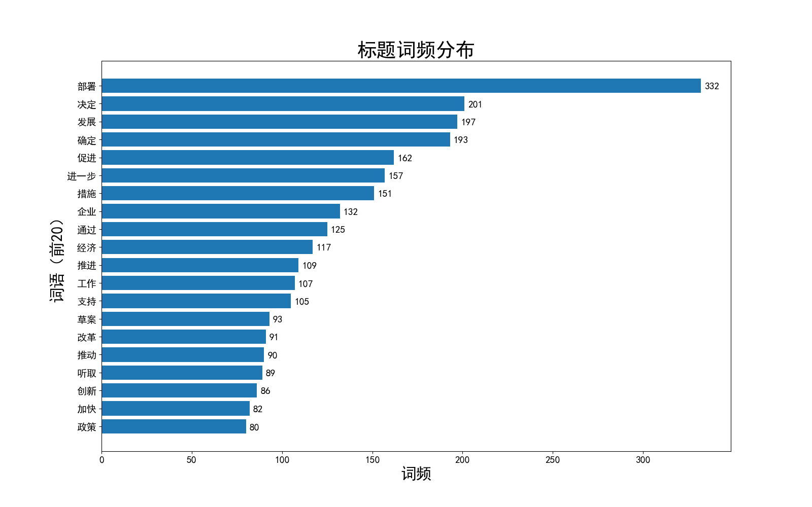
从词频上看，“部署”一词词频极高，说明了国务院在国家行政中总揽全局，指挥各方的地位；
从词性上看，“发展”是出现频率最高的名词，而“促进”、“进一步”等发展性的动词也处在排序的前列，体现了国务院常务会议的一般性质，即通过政府安排关注和促进某个领域的推进，这与我国一以贯之的“有为政府”理念是相适应的。

1. 正文的分词与词频统计结果如图所示：
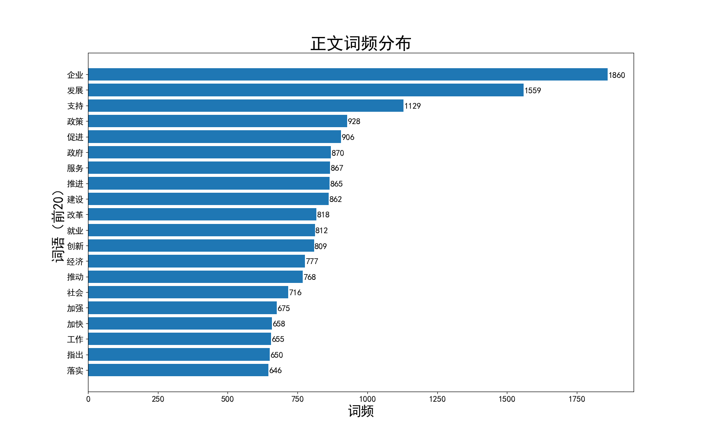
“企业”与“发展”以压倒性优势占据了词频最高的两个词语，这充分体现了市场经济条件下，政府对于企业发展的关心与支持，从其他词频较高的词语，我们也能够看出，我国政府的服务职能发挥十分显著，在“就业”、“创新”、“紧急”等利国利民的重点领域，政府在日常工作中投入了大量的关切。

1. 关键词统计的结果如图所示：
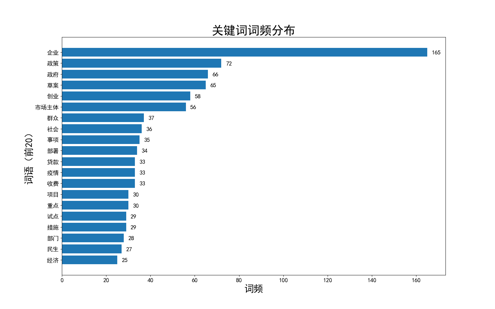
关键词统计的结果与正文词频类似，同时，由于关键词只提取名词，它对政府关注的主体的体现更加集中且明显，在前20个词频最高的词列表中的“企业”、“创业”、“市场主体”、“群众”都体现了这一特点。这些特征都充分体现了，国务院常务会议，讨论的是贴近民生的内容，是符合人民群众期待的，也是积极回应广大人民真实需求的。

1. “三农”领域词汇的统计
从2004年起，连续十九年，中央一号文件都关注“三农”，即“农业”、“农村”、“农民”问题，这充分体现了国家政策对这一话题的特殊倾斜，也体现了“三农”问题的重要性。
本研究即从组成“三农”的三个词出发，探究国务院常务会议对这一政策方向的回应，探讨我国“三农”政策随时间变迁的规律

- 首先，本研究分析了“三农”词语随年份变化的情况，结果作图如下：
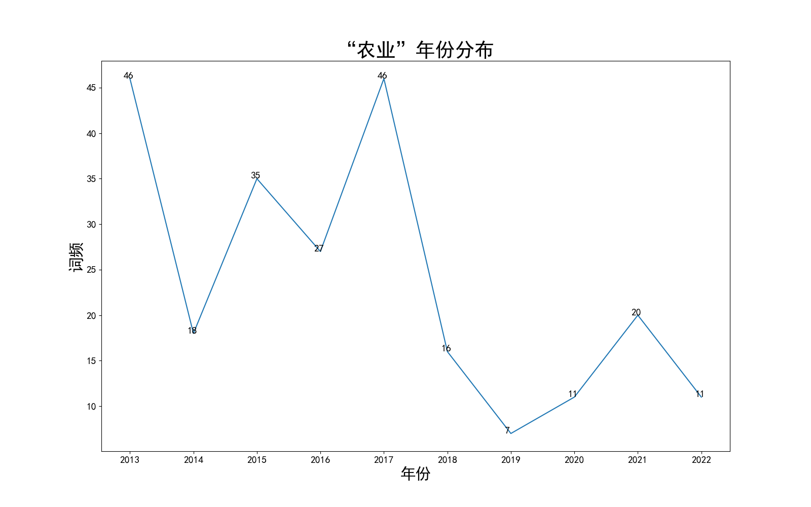
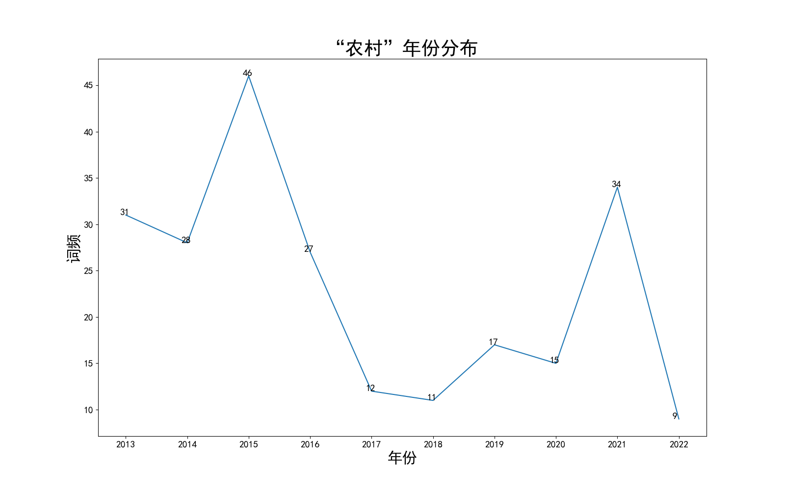
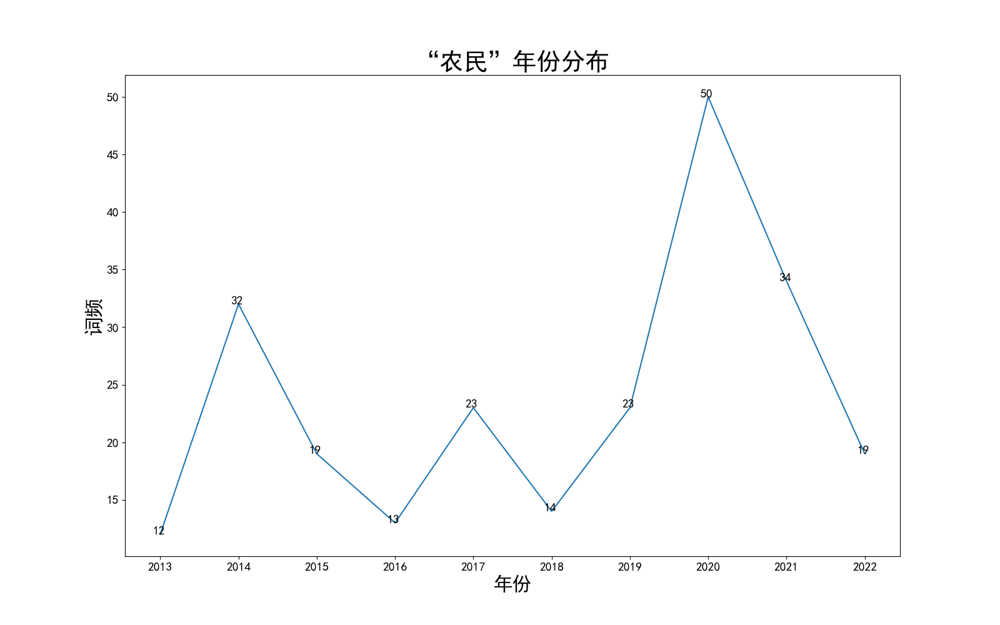
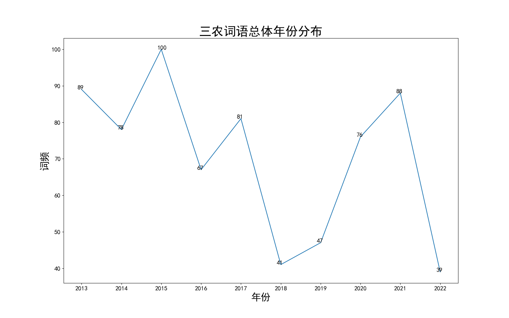
在总体上，“三农”相关词语在2015年前后的受到的关注最高，随后出现频率下降，在2021年前后重新受到集中关注，这与2015年“加快农业现代化建设”，2020年“脱贫攻坚”，2021年“乡村振兴”这一系列国家战略有着密不可分的联系，大致勾画了近十年来，我国三农领域政策的重要时间节点，对于我们理解“三农”政策的历史脉络有着重要的启示。
在三个词语各自的维度上，对于“农业”2020年以前的词频明显高于之后，而对于“农民”则恰好相反，至于“农村”，在2020年前后的波峰相差不多，这实际上反映了我国“三农”政策着力点的变化，提示着在过去十年里，我国的政策发力点逐渐从农业发展、农村建设，转向了农村宜居、农民富裕，从“关注产业”逐渐过渡到“关注人”。这实际上与我国贯彻新发展理念，建设新发展格局的进程相一致，与我国所处的客观历史进程息息相关。

- 接着，本研究分析了“三农”词语随月份变化的情况，结果作图如下：
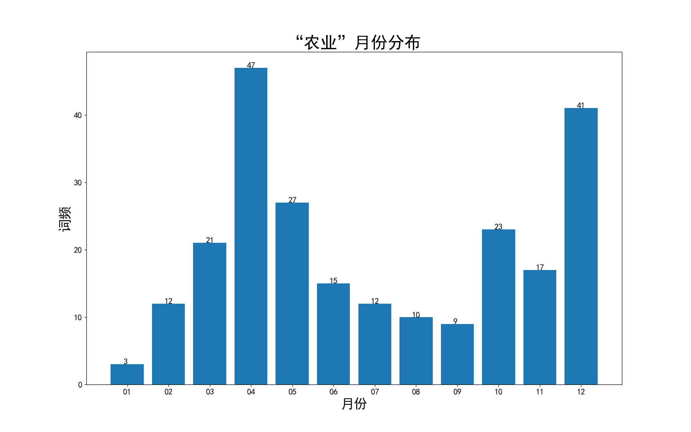
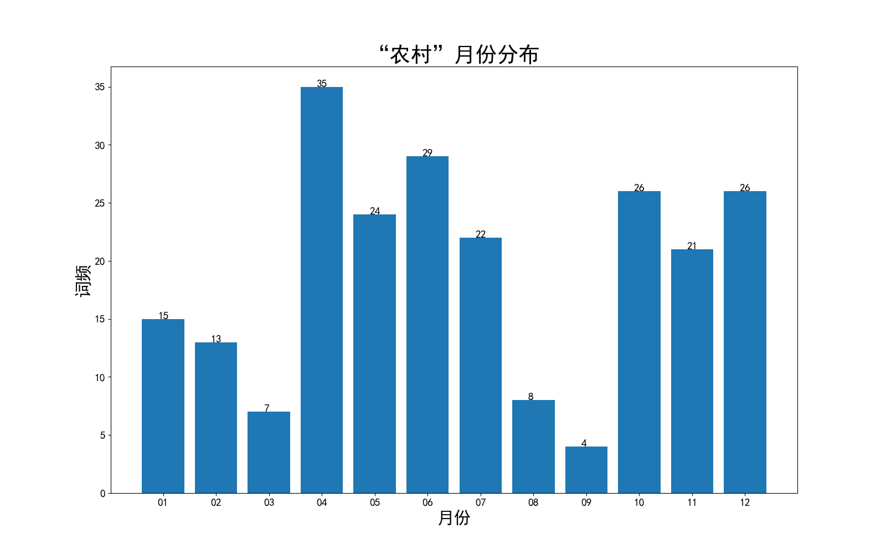
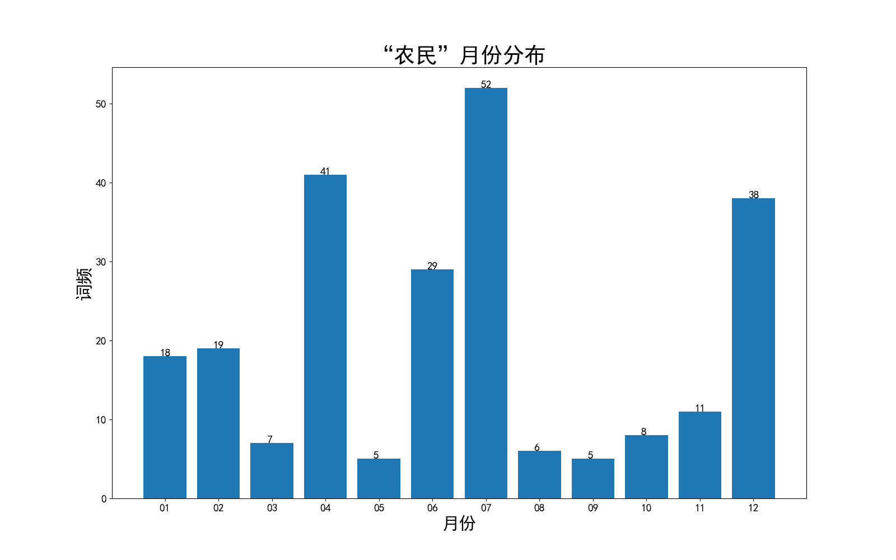
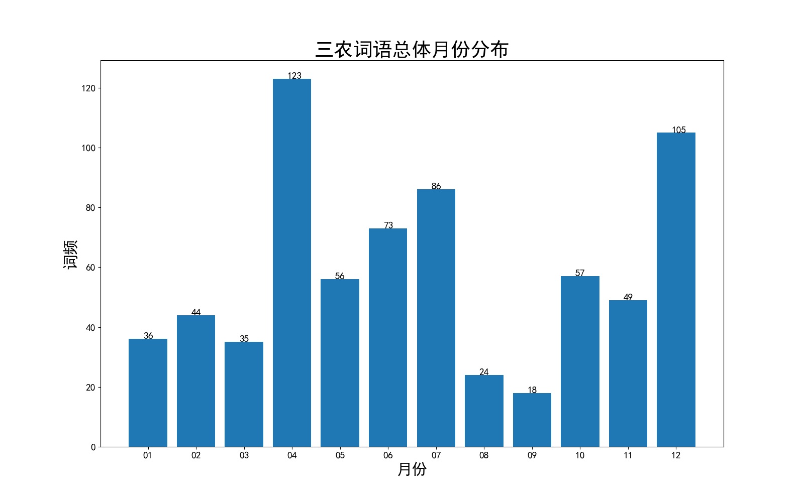
在各词语随月份变化的情况中，只有“农业”表现出了明显的季节性，这是符合农业实际情况的，也说明了农村建设与农民富裕的推进政策并不与农业生产的情况绑定，体现了政策实施的科学性特点。
# 总结
从总体上，国务院常务会议确实做到了对民生热点与群众关切进行及时回应，同时紧跟党中央政策，体现了我国政府接受党的领导、为人民服务的特点